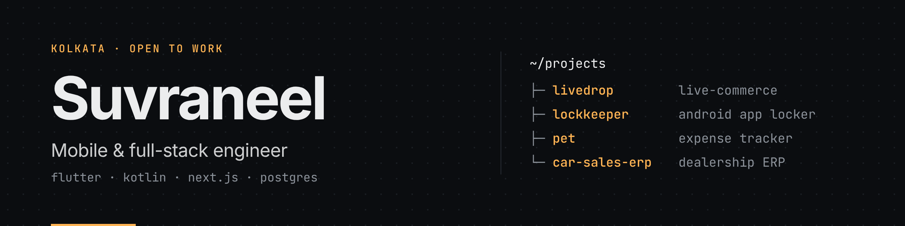

<picture>
  <source media="(prefers-color-scheme: dark)" srcset="assets/banner-dark.png">
  <source media="(prefers-color-scheme: light)" srcset="assets/banner-light.png">
  
</picture>

I build **mobile-first products** — Flutter apps with native Kotlin where it matters, Next.js on the web, and Postgres doing the heavy lifting underneath. I care about the unglamorous parts: row-level security, offline behaviour, test coverage, and shipping.

BCA (Hons), MAKAUT '27 · Open to internships and freelance work · [psuvraneel@gmail.com](mailto:psuvraneel@gmail.com)

### Selected work

<table>
<tr>
<td width="50%" valign="top">

**[LiveDrop](https://github.com/psuvraneel-cyber/LiveDrop)** · [live ↗](https://livedrop-in.vercel.app) 
Real-time live-commerce for boutique sellers who sell over Facebook Live and WhatsApp. Replaces comment-flood claiming, UPI screenshot matching and hand-written labels with one atomic flow.  
`Next.js 16` `React 19` `Flutter` `Supabase` `PostgreSQL 17` 
32 versioned migrations · RLS on every table · 460 passing tests · CI on every push

</td>
<td width="50%" valign="top">

**[LockKeeper](https://github.com/psuvraneel-cyber/LockKeeper)** 
Android app locker that's actually hard to bypass. Native Kotlin services handle event interception and overlays; admin-password friction guards against uninstall and force-stop.  
`Kotlin` `Flutter` `Android Services` 
No INTERNET permission · zero analytics · fully on-device

</td>
</tr>
<tr>
<td width="50%" valign="top">

**[P.E.T. — Personal Expense Tracker](https://github.com/psuvraneel-cyber/Personal-Expense-Tracker)** 
Automatic UPI and bank-alert tracking via on-device SMS parsing, plus an AI finance copilot proxied through a Cloudflare Worker so no API key ships in the APK.  
`Flutter` `Firebase` `SQLite` `Cloudflare Workers`

</td>
<td width="50%" valign="top">

**[Car Sales & Inventory ERP](https://github.com/psuvraneel-cyber/Car-Sales-And-Inventory-Management-System-ERP-)** 
Dealership ERP covering inventory, customers, sales, Razorpay payments and test-drive scheduling.  
`Django 5` `PostgreSQL` `Razorpay` `Gunicorn`

</td>
</tr>
</table>

### Stack

**Mobile** — Flutter · Dart · Kotlin · Riverpod · Provider 
**Web** — Next.js · React · TypeScript · Tailwind · Django 
**Data** — PostgreSQL · Supabase · Firebase · SQLite 
**Infra** — GitHub Actions · Vercel · Cloudflare Workers 
**Also** — Python · Java · PHP

If something here is useful to you, a ⭐ on the repo helps more than you'd think.
